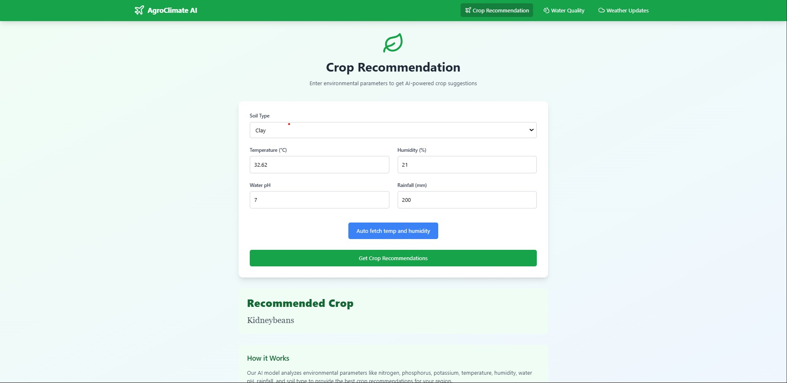
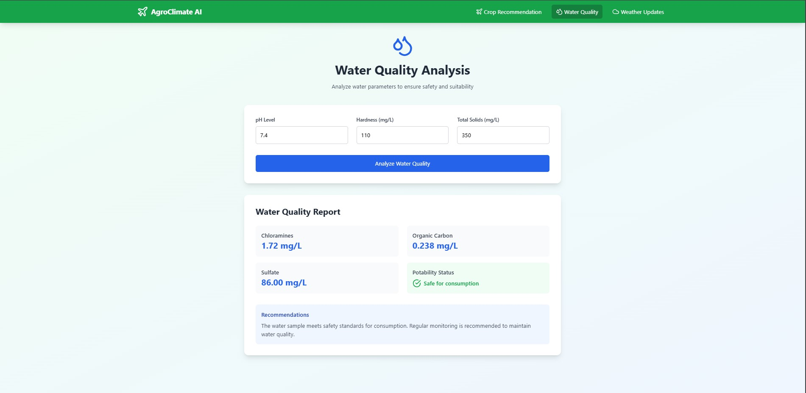
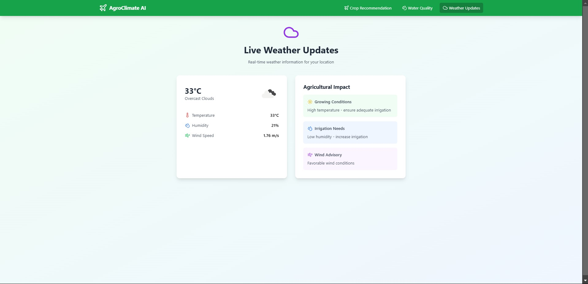

# 🌱 **AI-Driven Climate Precision Agriculture**

**AI-Driven Climate Precision Agriculture** leverages machine learning and real-time environmental data to improve agricultural practices. The system provides **crop recommendations**, **predicts climate conditions**, and **analyzes water quality** based on various parameters, ensuring safe and sustainable agriculture.

---

## 🚀 **Features**

- **Crop Recommendation**: Recommends the best crops to plant based on environmental and soil factors.
- **Climate Prediction**: Fetches real-time weather data and forecasts the climate for better agricultural planning.
- **Water Quality Monitoring**: Analyzes water quality for safe irrigation or consumption based on parameters like pH, hardness, and solids.
- **Responsive Design**: Ensures compatibility across devices for ease of access.
- **Flask Backend**: Uses Flask to serve models and manage requests for predictions.

---

## 🛠 **Tech Stack**

- **Frontend**: React, TypeScript, Vite
- **Backend**: Flask, Python, Machine Learning models
- **Styling**: Tailwind CSS for responsive design
- **Deployment**: Firebase Hosting for frontend, Flask for backend API
- **Data**: ML models for crop recommendation, climate predictions, and water quality analysis.

---

## 🔑 **Prerequisites**

1. **Node.js** and **npm** installed.
2. **Python** and **pip** for the Flask backend.
3. **Firebase Project** setup for frontend hosting.
4. **Machine Learning Models** trained for the recommendation system.
5. **Arduino Integration** for potential hardware monitoring (if used in conjunction).

---

## ⚙️ **Installation**

### 1. Clone the Repository

```bash
git clone https://github.com/yourusername/AI-Driven-Climate-Precision-Agriculture.git
cd AI-Driven-Climate-Precision-Agriculture
```
#### 2. Backend Setup
Navigate to the src/ folder and set up a virtual environment:

```
Copy
Edit
cd src
python -m venv venv
source venv/bin/activate  # On Windows, use `venv\Scripts\activate`
```
## Install the required Python dependencies:

```
pip install -r requirements.txt
```
#### Run the Flask backend:

```
python app.py
```
This will start the backend on http://localhost:5000.

### 3. Frontend Setup
Navigate to the root of the project and install frontend dependencies:

```
npm install
```
Run the development server:

```
npm run dev
```
This will start the frontend on http://localhost:3000.
```
📂 Folder Structure
bash
Copy
Edit
src/
├── components/      # React components
├── services/        # API services and Firebase functions
├── config/          # Firebase and other config files
├── types/           # TypeScript types
├── App.tsx          # Main application file
├── main.tsx         # Entry point for React
├── index.css        # Global styling
├── app.py           # Flask backend
```
## 📸 Screenshots
Here are some examples of the output you will receive from the system:

### Crop Recommendation Output

This output shows the recommended crops based on environmental and soil parameters.

### Climate Prediction Output

This output displays the real-time climate prediction data for the given location.

### Water Quality Analysis Output

This is the water quality report generated by the system, showing parameters such as Chloramines, Sulfate, Organic Carbon, and potability status.
## 🔧 Usage
### Backend Integration
The Flask backend processes incoming requests, runs ML models, and provides predictions.
Ensure that the correct machine learning models are loaded and the API is properly connected to your frontend.
### Frontend Integration
The React frontend fetches data from the backend API, displays the results, and offers a user-friendly interface.
Use the frontend to submit environmental data and view the results for crop recommendations, climate predictions, and water quality analysis.
## ⚙️ Troubleshooting
1. CORS Issues:
If you encounter issues with CORS, make sure the backend has proper CORS headers configured, or use a proxy in your frontend.

2. 404 Errors:
If you get 404 errors from the backend, check that the Flask routes are correctly set up and that the server is running.

3. Model Errors:
Ensure that the machine learning models are properly trained and placed in the correct directory (models/).

## 🚀 Future Enhancements
Add support for additional weather and climate data sources for more accurate predictions.
Integrate real-time sensor data for automatic updates on crop and water conditions.
Include a mobile app for better accessibility and monitoring.
## 📝 License
This project is licensed under the Apache 2.0 - see the LICENSE file for details.
License
## Acknowledgments
The machine learning models are trained on relevant datasets for crop recommendations and water quality analysis.
The climate prediction data is fetched from reliable weather services for real-time insights.
Special thanks to all contributors and libraries used in this project.

